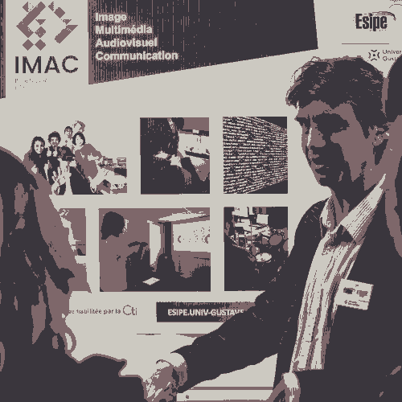
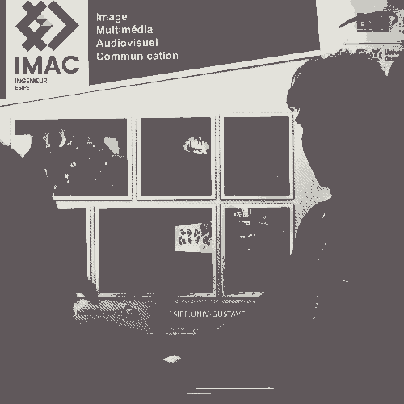
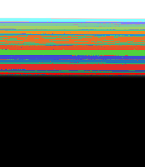
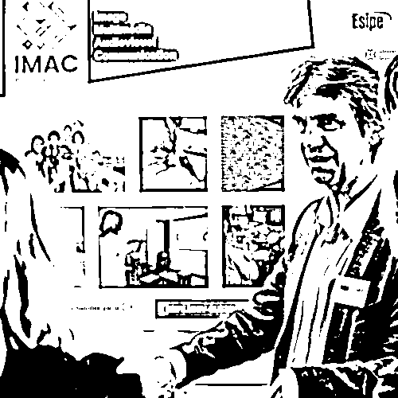
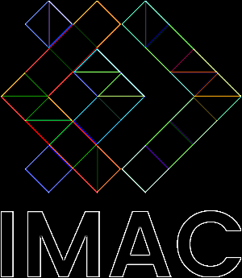
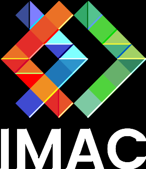
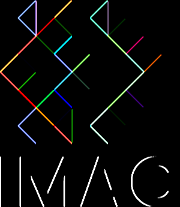
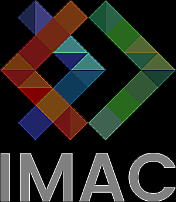

# Wokshop - Synthese de l'image 

*Ce repository contient deux branches représentant nos deux avancées. Les programmes sont à peu près similaire.*

### Diamond Square

Le programme est juste une adaptation du pseudo-code de la vidéo de présentation en C++. Mon code est très mal écrit ce qui le rend un peu difficile à lire. Néanmoins voici des exemples de rendu. 


| Duretée     | Image        |
| ------------- |:-------------:| 
| 0.1      | .png) |
| 0.5     | .png)    | 
| 1 | .png)     | 
| 2 | .png)     |


### K-Means

On peut justement voir avec la photo donnée la limite de ce filtre. Il ne prendra pas forcement les K-couleurs les plus représenté. Surtout dans une image où beaucoup de couleurs sont représenté à la même intensité. On peut changer la variable `facteurK` dans le programme pour choisir le nombre de couleur.

Voici des exemples pour plusieurs K :

| K - couleur(s)     | Image        |
| ------------- |:-------------:| 
| 3  (plusieurs essais)    |  |
| 5     |     | 
| 10 |     | 
| 30 |     |

### Filtre de Kuwahara

Mon code prend un peu de temps selon moi, peut-être un soucis d'optimisation. Le rendu est néanmoins très satisfaisant et on peut régler l'intensité via la variable `intensiteFlou`. Il faut bien faire attention que l'image d'entrée du programme est flou, sinon cela va juste retourner une image flou.

Voici plusieurs exemples avec différentes intensitées :

| Intensité de flou de l'entrée | Intensité de la sortie    | Image        |
| --------- | ------------- |:-------------:| 
|1| 2    |  |
|1| 3     |     | 
|1| 6     |     |

<details><summary>Pourquoi pas une intensité plus haute ?</summary>
*Plus on fait une intensité élevée, plus la compleité augmente vite donc moins facile à générer...*
</details>


On peut aussi faire varier l'image flou d'entrée. Plus l'image d'entrée est flou, plus notre "peinture" va sembler imprécise :

| Intensité de flou de l'entrée | Intensité de la sortie    | Image        |
| --------- | ------------- |:-------------:| 
|1| 2    |  |
|3| 2     |     | 
|10| 2     |     |

### Tri de pixels

Pour créer notre rendu final, nous sommes passées par 3 étapes :

#### 1) Trier toute l'image par luminosité :

Le code est particuliérement simple mais au début il mettait du temps à nous sortir un resultat. Cela venait du fait que l'on fesait le tri des pixels un nombre fois égal au nombre de pixels dans l'image... Alors qu'il suffisait de le faire une fois ! :/

Voici donc ce que cela donne : 
*Magnifque !*

#### 2) Trier chaque ligne par luminosité :

Une fois que l'on sait trier l'image, il nous suffit de déterminer les bornes et le nombre d'itération de tris pour trier par ligne.

Voici ce que cela donne : 

#### 3) Trier des parties aléaroires par luminosité :

Il faut maintenant ajouter de l'aléatoire sur les parties à trier.

Voila ce que l'on obtient : 

### Différences de Gaussiennes

Une fois que l'on sait faire un flou, il suffit de soustraire les couleurs d'une image bien flou aux couleurs de l'image moins flou. Les résultats différent beaucoup en fonction des flous choisies mais aussi en fonction du facteur `facteurBlancNoir` qui va déterminer après soustraction des images si un pixel doit être noir ou blanc.

Voici ce que l'on obtient avec :
```cpp
int intensiteFlou{1};
int intensiteFlouSub{5};
float const facteurBlancNoir{0.2};
```



### Filtre séparable

Il suffit de modifier son code de Convolution, ce qui donne :


### Netteté, contours, etc.

Ici, on peut tester plein de matrices différentes :

||||
| --------- | ------------- |-------------| 
|Sharpen|Outline|Emboss|

||||
| --------- | ------------- |-------------| 
|Top Sobel|Bot Sobel|Personnalisé|

### Concolutions

Une fois la méthode compris, il suffit de réfléchir quoi faire lorque l'on dépasse de l'image. Pour cela si notre pixel `x+i` dépasse, on le remplace par `x` (de même pour `y`).
On peut régler l'intensité de flou avec `intensiteFlou` !

Cela nous donne : 

| Intensité de flou    | Image        |
| ------------- |:-------------:| 
| 1    |  |
| 3     |     | 
| 10     |     |